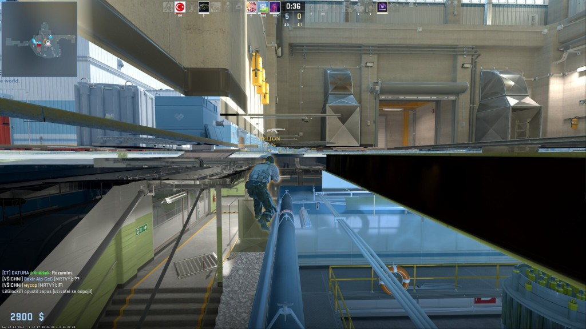
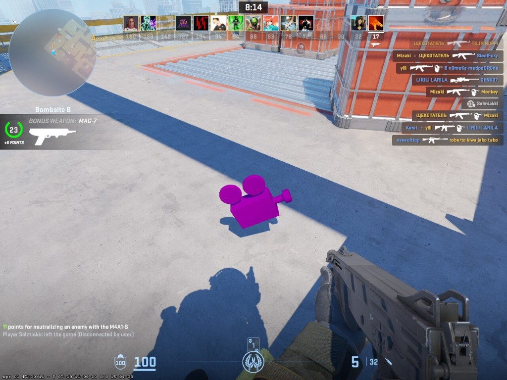
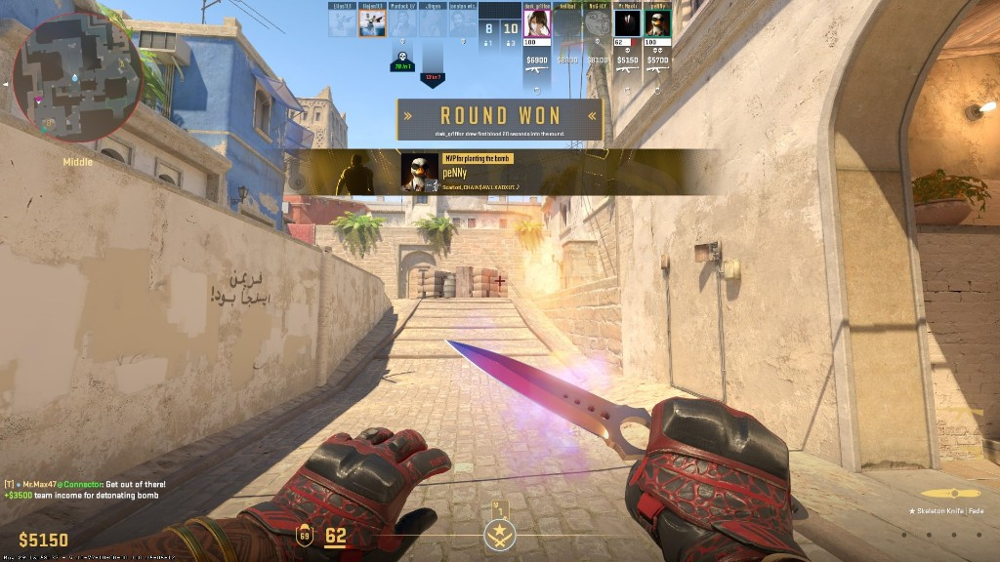
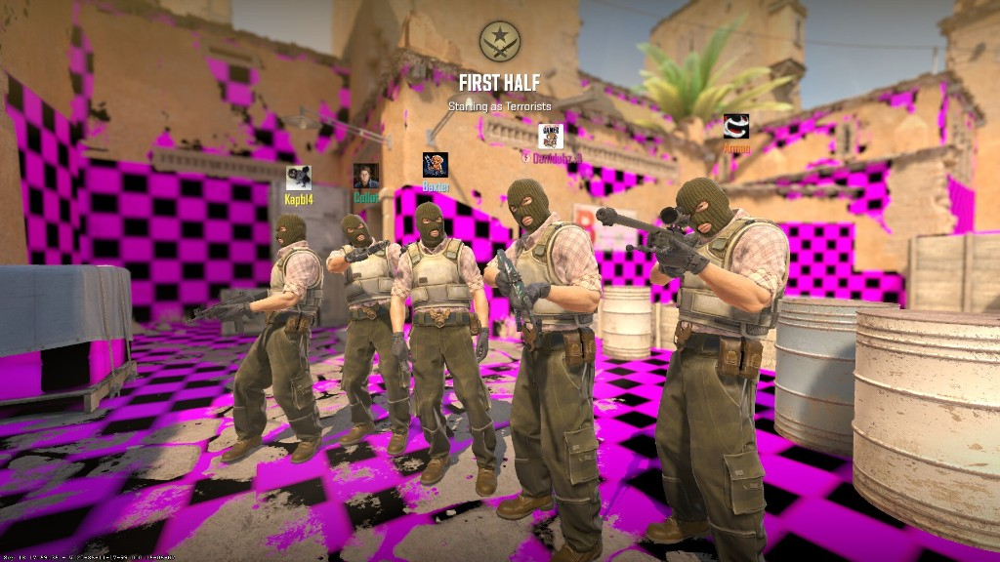
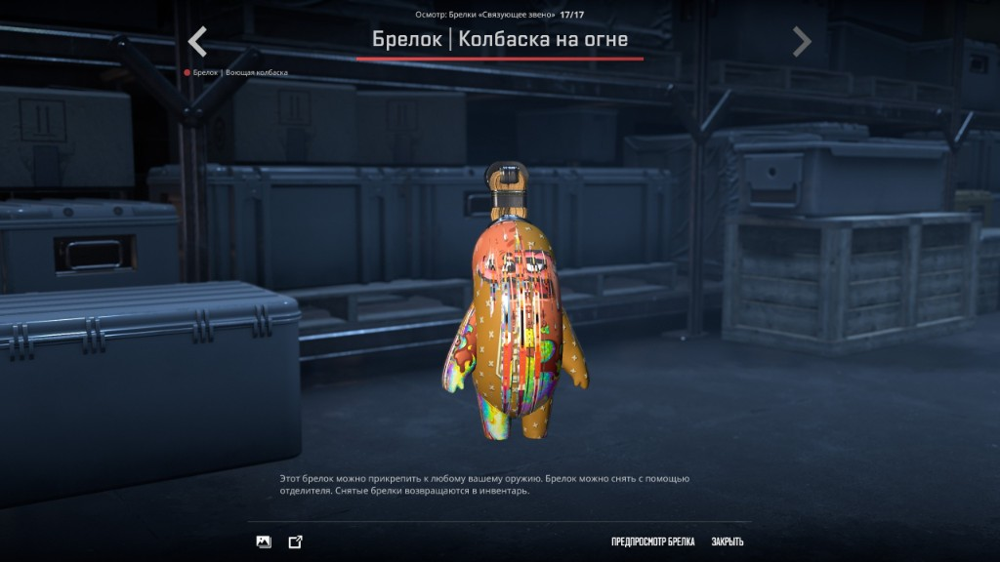
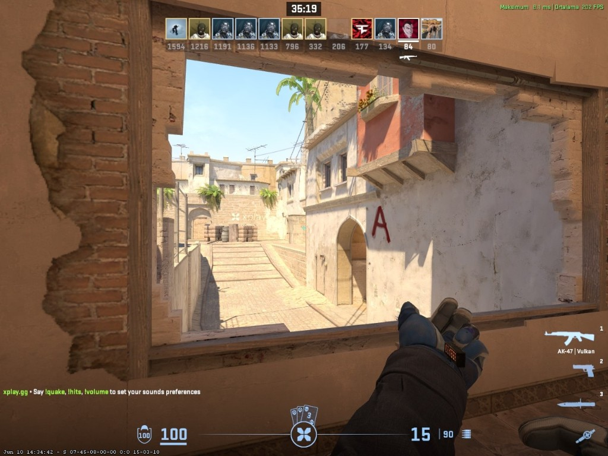
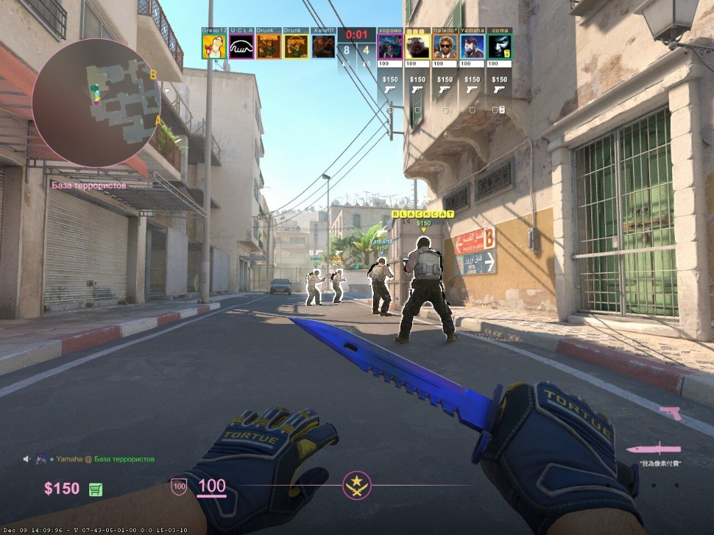
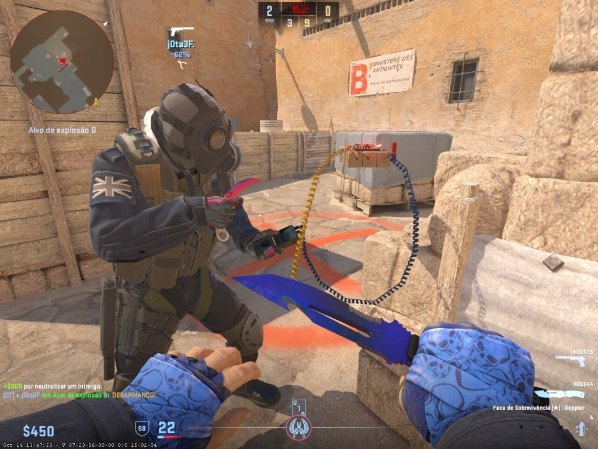

# Практическая работа №5 — системное тестирование игр

**Дисциплина:** МДК.01.02 «Поддержка и тестирование программных модулей».  
**Студент:** Богданова М.Н., группа ЗИСИП-423.

**Репозиторий:** [github.com/mildxw/pit](https://github.com/mildxw/pit) · ветка **`pr5`**.  
Практическая работа №4 (WPF) — ветка **`pr4`**.

---

## Объект тестирования

**Counter-Strike 2** (Steam, ПК). Ручное системное негативное тестирование методом «чёрного ящика». Ориентир по критериям: [чек-лист тестирования игр (ProgKids)](https://www.progkids.com/blog/chek-list-testirovaniya-igr-dlya-nachinayushih).

## Скриншоты дефектов (репозиторий)

| № | Файл | Суть дефекта |
|---|------|----------------|
| 1 | [1.png](screenshots/1.png) | Nuke: просвечивание геометрии, видимость сквозь пол/стены |
| 2 | [2.png](screenshots/2.png) | Vertigo B: фиолетовая модель «камеры» (missing texture / лишний объект) |
| 3 | [3.png](screenshots/3.png) | Mirage Mid: артефакт на ноже, сбои аватаров в панели игроков |
| 4 | [4.png](screenshots/4.png) | Экран FIRST HALF: шахматные текстуры окружения |
| 5 | [5.png](screenshots/5.png) | Осмотр брелока: полосы на текстуре |
| 6 | [6.png](screenshots/6.png) | Mirage к A: дыра в стене, «висящая» рама |
| 7 | [7.png](screenshots/7.png) | Mirage T-spawn: белые контуры союзников не у всех |
| 8 | [8.png](screenshots/8.png) | Mirage B: провода дефьюза в воздухе |

## Баг-трекеры (выбор для отчёта)

| Система | Примечание |
|---------|------------|
| Mantis, Redmine, Trac, BugTracker.NET | Свой сервер |
| Kaiten | [kaiten.ru](https://kaiten.ru) |
| **GitHub Issues** | Использовано в работе |

---

## Сводная таблица (10 дефектов)

| № | Платформа | Компонент | Кратко | Приоритет | Скрин |
|---|-----------|-----------|--------|-----------|-------|
| 1 | Win / Steam | Nuke | Просвечивание геометрии | Критический | screenshots/1.png |
| 2 | Win / Steam | Vertigo B | Фиолетовая «камера» | Высокий | screenshots/2.png |
| 3 | Win / Steam | Mirage Mid | Нож + HUD аватары | Средний | screenshots/3.png |
| 4 | Win / Steam | Интро FIRST HALF | Шахматные текстуры | Критический | screenshots/4.png |
| 5 | Win / Steam | Осмотр брелока | Полосы на текстуре | Средний | screenshots/5.png |
| 6 | Win / Steam | Mirage → A | Дыра в стене | Высокий | screenshots/6.png |
| 7 | Win / Steam | Mirage T-spawn | Белые контуры | Высокий | screenshots/7.png |
| 8 | Win / Steam | Mirage B | Провода дефьюза | Высокий | screenshots/8.png |
| 9 | Win / Steam | Матчмейкинг | Задержка «Принять» | Средний | — |
| 10 | Win / Steam | Табло Tab | Просадка FPS | Низкий | — |

## Вывод

Дефекты в основном графические (карты Mirage, Nuke, Vertigo, меню инвентаря) и один анимационный (дефьюз); дополнительно зафиксированы поведение матчмейкинга и нагрузка от UI. Это подтверждает необходимость ручного системного тестирования клиента шутера.

## Впечатления

Удобно фиксировать карту и режим в шагах воспроизведения; скриншоты с HUD и чатом ускоряют разбор.
