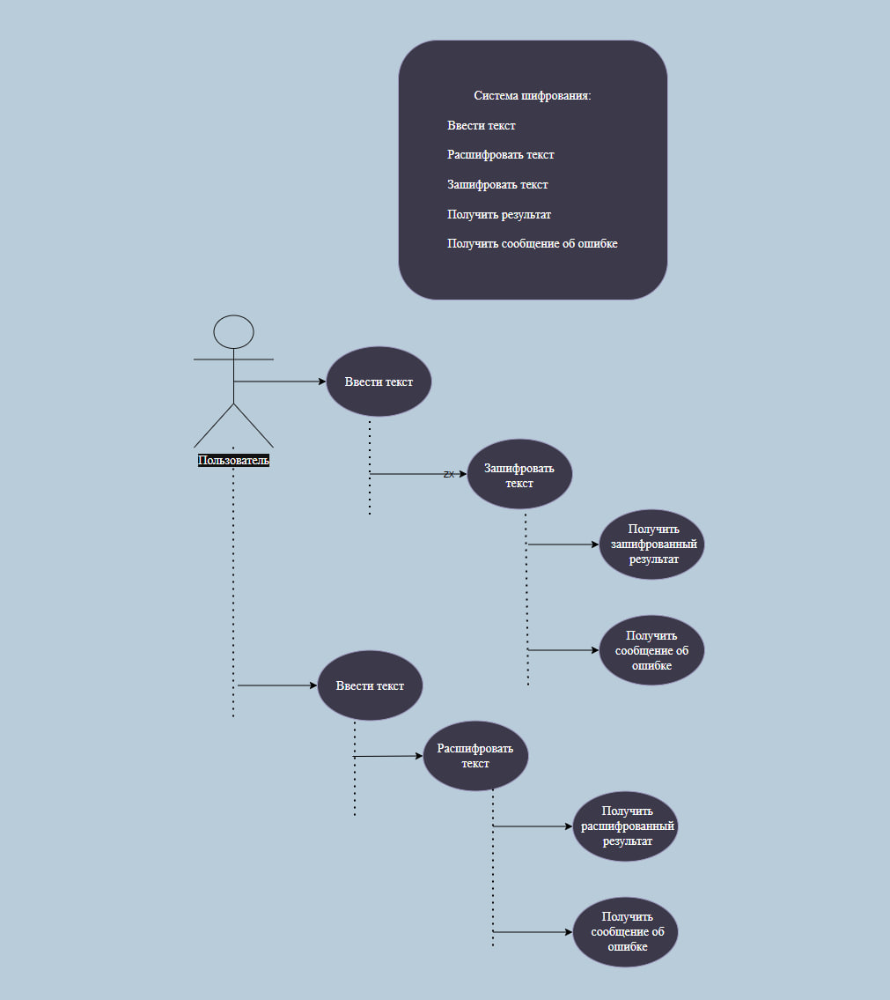
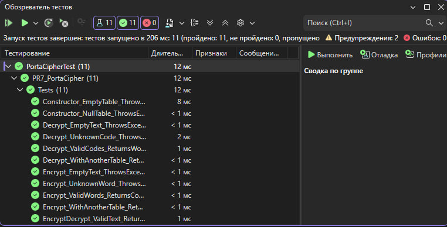

# Практическая работа №7. Часть 2.
## Отладка программы различными способами. 

## Информация о проекте

**Название проекта:** PR7-PortaCipher  
**Тема:** Разработка и тестирование приложения для шифрования и дешифрования информации  
**Вариант:** 14  
**Алгоритм:** Шифр Порта  
**Метод:** алгоритм на основе книги кодов  
**Среда разработки:** Microsoft Visual Studio  
**Язык программирования:** C#  
**Тип приложения:** графическое приложение Windows Forms  

## Разработчик

**ФИО:** Богданова М.Н. 
**Группа:** ИСиП-423 

## Цель работы

Цель практической работы — произвести процедуру отладки программного обеспечения встроенными средствами среды программирования Microsoft Visual Studio, а также выполнить автоматизированное и ручное тестирование разработанного приложения.

## Описание предметной области

В данной работе реализуется приложение для шифрования и дешифрования информации с помощью шифра Порта на основе книги кодов.

Книга кодов представляет собой таблицу замен, в которой каждому слову соответствует определённый код. При шифровании приложение заменяет исходные слова на заданные коды. При дешифровании выполняется обратная операция: коды заменяются исходными словами.

Пример таблицы замен:

| Слово | Код |
|---|---|
| мир | A1 |
| труд | B2 |
| май | C3 |
| кот | D4 |
| шпион | E5 |
| план | F6 |
| данные | G7 |
| слон | H8 |

Пример работы приложения:

| Операция | Входные данные | Результат |
|---|---|---|
| Шифрование | мир труд май | A1 B2 C3 |
| Дешифрование | E5 D4 G7 | шпион кот данные |

## Требования к приложению

### Функциональные требования

- приложение должно выполнять шифрование слов с помощью таблицы замен;
- приложение должно выполнять дешифрование кодов обратно в слова;
- таблица кодов должна быть конфигурируемой;
- приложение должно работать со словами;
- приложение должно обрабатывать отсутствующие слова;
- приложение должно обрабатывать отсутствующие коды;
- приложение должно проверять пустой ввод;
- приложение должно выводить сообщение об ошибке при некорректных данных.

### Нефункциональные требования

- приложение должно иметь графический интерфейс;
- интерфейс должен содержать поле ввода текста;
- интерфейс должен содержать поле вывода результата;
- интерфейс должен содержать кнопки для шифрования и дешифрования;
- приложение должно отображать всплывающие сообщения при ошибках;
- код должен быть документирован XML-комментариями;
- приложение должно быть протестировано автоматизированными и ручными тестами.

## Диаграмма вариантов использования

## Тестовые сценарии

| ID | Название теста | Тип теста | Входные данные | Ожидаемый результат | Фактический результат | Статус |
|---|---|---|---|---|---|---|
| TC-01 | Шифрование известных слов | Позитивный | кот дом мир | A1 B2 C3 | A1 B2 C3 | Пройден |
| TC-02 | Дешифрование известных кодов | Позитивный | A1 B2 C3 | кот дом мир | кот дом мир | Пройден |
| TC-03 | Шифрование и дешифрование текста | Позитивный | кот дом | После дешифрования получается исходный текст | После дешифрования получен текст: кот дом | Пройден |
| TC-04 | Использование другой таблицы кодов при шифровании | Позитивный | солнце луна | X1 X2 | X1 X2 | Пройден |
| TC-05 | Использование другой таблицы кодов при дешифровании | Позитивный | R1 L2 | река лес | река лес | Пройден |
| TC-06 | Шифрование отсутствующего слова | Негативный | собака | Сообщение об ошибке об отсутствии слова в таблице | Получено сообщение об ошибке | Пройден |
| TC-07 | Дешифрование отсутствующего кода | Негативный | Z9 | Сообщение об ошибке об отсутствии кода в таблице | Получено сообщение об ошибке | Пройден |
| TC-08 | Шифрование пустой строки | Негативный | пустая строка | Сообщение об ошибке о пустом тексте | Получено сообщение об ошибке | Пройден |
| TC-09 | Дешифрование пустой строки | Негативный | пустая строка | Сообщение об ошибке о пустом тексте | Получено сообщение об ошибке | Пройден |
| TC-10 | Создание шифра с пустой таблицей | Негативный | пустая таблица кодов | Исключение о пустой таблице кодов | Получено исключение | Пройден |
| TC-11 | Создание шифра с таблицей null | Негативный | null | Исключение о пустой таблице кодов | Получено исключение | Пройден |
| TC-12 | Проверка графического интерфейса | Нефункциональный | Запуск приложения | Форма открывается, элементы отображаются корректно | Форма открылась корректно | Пройден |
| TC-13 | Проверка сообщения об ошибке в интерфейсе | Нефункциональный | неизвестное слово | Отображается всплывающее окно с ошибкой | Сообщение отображается | Пройден |

## Автоматизированное тестирование

Для проверки функциональных требований были разработаны автоматизированные тесты на языке C# с использованием NUnit.

Проверялись следующие ситуации:

- шифрование известных слов;
- дешифрование известных кодов;
- шифрование и последующее дешифрование текста;
- работа с разными таблицами кодов;
- обработка отсутствующих слов;
- обработка отсутствующих кодов;
- обработка пустого ввода;
- обработка пустой таблицы кодов;
- обработка значения null.

### Скриншот окна «Обозреватель тестов»

## Использованные средства отладки Microsoft Visual Studio

В ходе выполнения работы были использованы следующие средства отладки:

- точки останова;
- пошаговое выполнение программы;
- Step Over;
- Step Into;
- Continue;
- просмотр значений переменных;
- окно Locals;
- окно Watch;
- анализ исключений;
- анализ вывода приложения;
- перезапуск приложения в режиме отладки.

## Журнал ручного тестирования

| ID | Проверка | Действие | Ожидаемый результат | Фактический результат | Статус |
|---|---|---|---|---|---|
| MT-01 | Запуск приложения | Запустить приложение | Открывается главная форма | Главная форма открылась | Пройден |
| MT-02 | Проверка элементов интерфейса | Осмотреть форму | Отображаются поле ввода, поле результата и кнопки | Все элементы отображаются | Пройден |
| MT-03 | Шифрование через интерфейс | Ввести `кот дом мир`, нажать «Зашифровать» | Появляется `A1 B2 C3` | Появилось `A1 B2 C3` | Пройден |
| MT-04 | Дешифрование через интерфейс | Ввести `A1 B2 C3`, нажать «Дешифровать» | Появляется `кот дом мир` | Появилось `кот дом мир` | Пройден |
| MT-05 | Проверка пустого ввода | Оставить поле пустым и нажать кнопку | Появляется сообщение об ошибке | Сообщение об ошибке появилось | Пройден |
| MT-06 | Проверка неизвестного слова | Ввести `собака`, нажать «Зашифровать» | Появляется сообщение об отсутствии слова | Сообщение появилось | Пройден |
| MT-07 | Проверка неизвестного кода | Ввести `Z9`, нажать «Дешифровать» | Появляется сообщение об отсутствии кода | Сообщение появилось | Пройден |

## Баг-репорт

| ID | Описание бага | Шаги воспроизведения | Ожидаемый результат | Фактический результат | Статус |
|---|---|---|---|---|---|
| BUG-01 | Ошибки подключения тестового проекта к графическому приложению | Создать тесты и подключить графический проект напрямую | Тесты запускаются корректно | Возникала ошибка загрузки исполняемого файла | Исправлено |
| BUG-02 | Ошибка добавления служебной папки `.vs` в Git | Выполнить `git add .` | Служебные файлы не добавляются | Git пытался добавить файл из `.vs` | Исправлено |
| BUG-03 | Ошибка при вводе отсутствующего слова | Ввести слово, которого нет в таблице | Пользователь получает понятное сообщение | После обработки исключения отображается сообщение | Исправлено |

## Исправление багов

В ходе работы были исправлены следующие проблемы:

- добавлен файл `.gitignore` для исключения служебных папок `.vs`, `bin`, `obj`;
- логика шифрования была вынесена в отдельный класс `PortaCipher`;
- добавлена обработка исключительных ситуаций;
- добавлены сообщения об ошибках через `MessageBox`;
- автоматизированные тесты были подключены к классу с логикой шифрования.

## Вывод

В ходе выполнения практической работы было разработано графическое приложение для шифрования и дешифрования информации с помощью шифра Порта на основе книги кодов.

Были реализованы два основных модуля: модуль шифрования и модуль дешифрования. Для проверки корректности работы приложения были разработаны автоматизированные тесты и проведено ручное тестирование.

Также были использованы встроенные средства отладки Microsoft Visual Studio: точки останова, пошаговое выполнение, просмотр переменных, окно Watch и окно Locals. В процессе тестирования были выявлены и исправлены ошибки, после чего приложение успешно прошло повторную проверку.

Практическая работа позволила закрепить навыки разработки, отладки и тестирования программного обеспечения.
