# Практическая работа №4 — поддержка и тестирование программных модулей

**Дисциплина:** МДК.01.02 «Поддержка и тестирование программных модулей».  
**Тема:** тестирование «белым ящиком» (части 1 и 2).  
**Вариант:** 14.  
**Студент:** Богданова М.Н., группа ЗИСИП-423.

Репозиторий: [github.com/mildxw/pit](https://github.com/mildxw/pit) (ветка **`pr4`**).

Оформление по аналогии с примером: [zakmira/Zakirova_PiT, ветка pr4](https://github.com/zakmira/Zakirova_PiT/tree/pr4).

---

## Задание (кратко)

Реализовано десктоп-приложение **WPF** на **.NET 8** (Windows): три страницы — две функции по варианту и экран с таблицей значений и графиком. Ведение версий в **Git**, описание в **README**, ручные тесты по заранее посчитанным эталонам.

## Структура репозитория (ветка pr4)

| Путь | Назначение |
|------|------------|
| `Практическая работа 4 Богданова/PitPr4.sln` | Решение Visual Studio |
| `Практическая работа 4 Богданова/PitPr4.App/` | Исходный код WPF |
| `Практическая работа 4 Богданова/PitPr4.App/Variant14Math.cs` | Формулы варианта 14 и проверки ОД |
| `screenshots/g/` … `d/` … `y/` | Скриншоты экранов (функция g, d, график) |

## Как собрать и запустить

1. Установите [.NET 8 SDK](https://dotnet.microsoft.com/download/dotnet/8.0) для Windows.
2. Откройте `Практическая работа 4 Богданова\PitPr4.sln` в Visual Studio 2022 **или** в терминале:

```bash
cd "Практическая работа 4 Богданова"
dotnet build PitPr4.sln -c Release
dotnet run --project PitPr4.App -c Release
```

## Вариант 14 (формулы)

1. **Страница 1 — \(g(x,y,z)\):**  
   \(g=\dfrac{y^{x+1}}{\sqrt[3]{|y-2|}}+\dfrac{x+\frac{y}{2}}{2|x+y|}(x+1)^{-1/\sin z}\)  
   Условия: \(y\neq 2\), \(x+y\neq 0\), \(\sin z\neq 0\).

2. **Страница 2 — \(d(x,y)\)** при \(f(x)\in\{\mathrm{sh}(x), x^2, e^x\}\):  
   - если \(x>y\): \((f(x)-y)^3+\arctan f(x)\);  
   - если \(y>x\): \((y-f(x))^3+\arctan f(x)\);  
   - если \(y=x\): \((y+f(x))^3+0{,}5\).

3. **Страница 3 — график:**  
   \(y=(x^{5/2}-b)\ln(x^2+12{,}7)\), для вещественных \(x\) в программе используется **\(x\ge 0\)**.

## Скриншоты работы приложения

### Функция g(x, y, z)

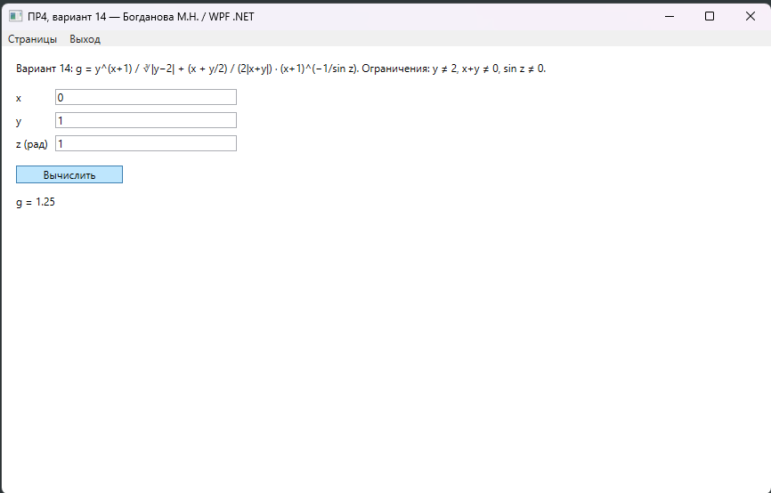
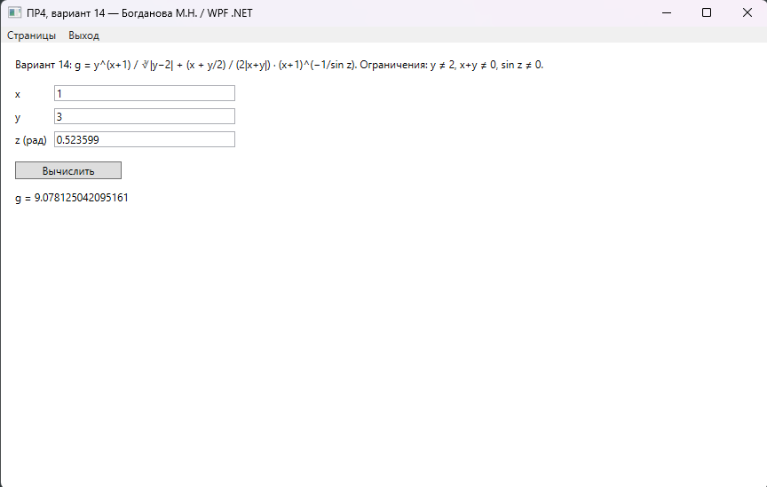
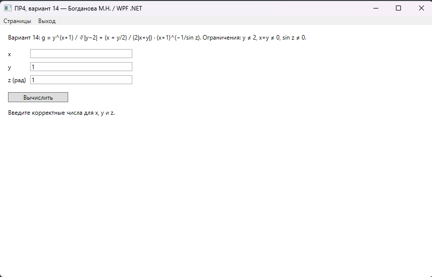
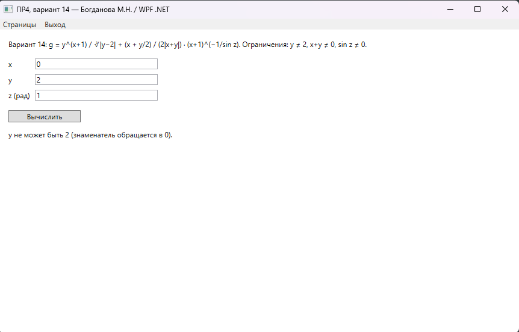
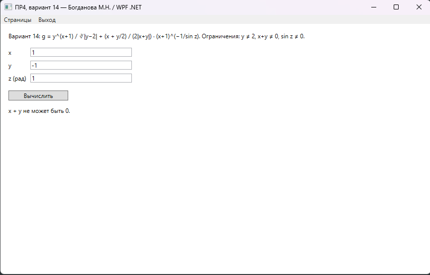
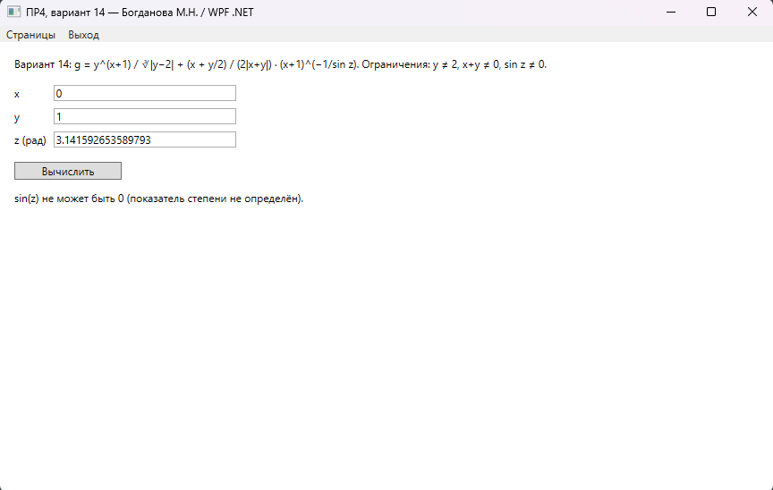
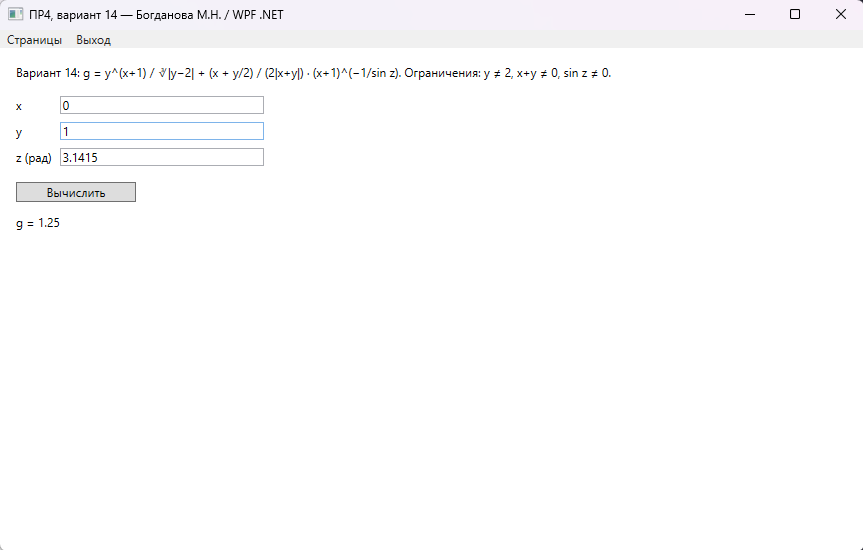

### Функция d(x, y, f)

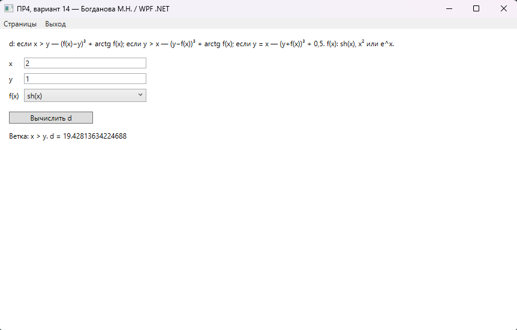
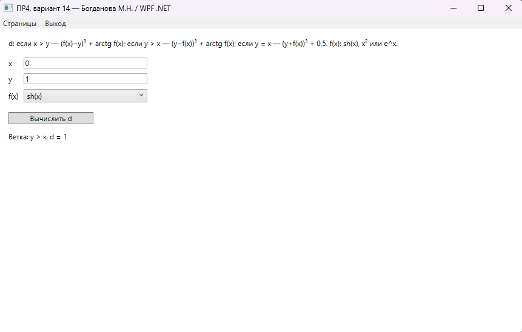
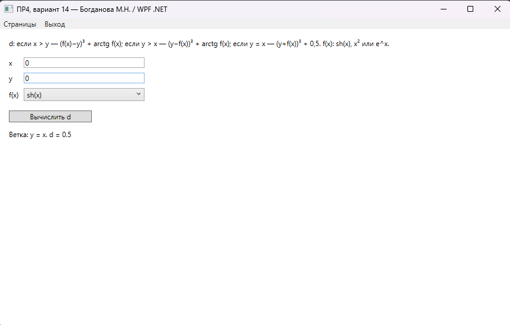
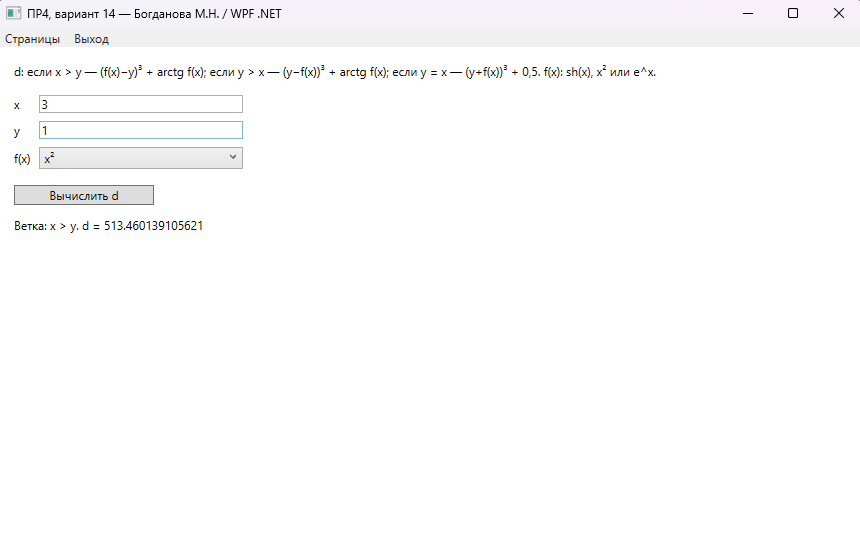

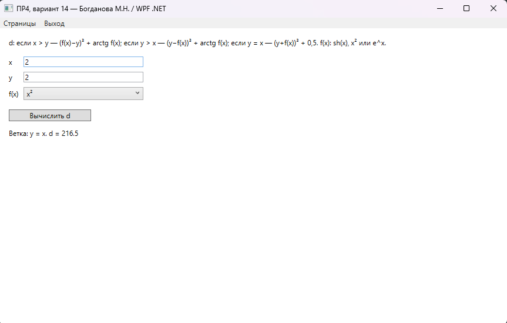
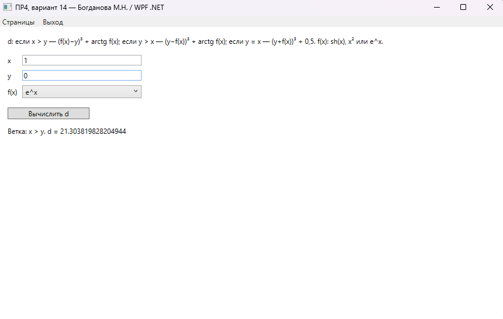
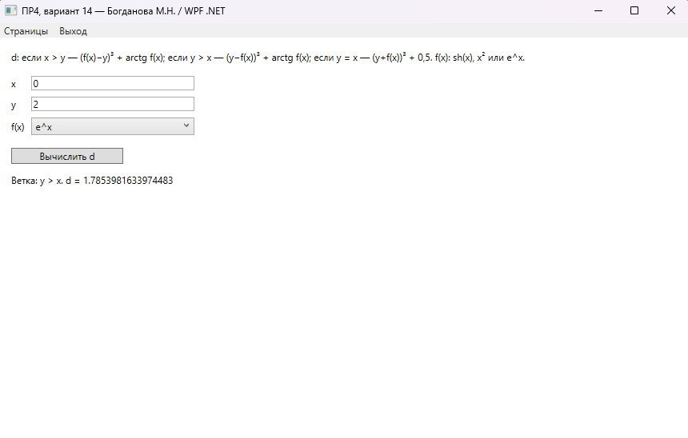
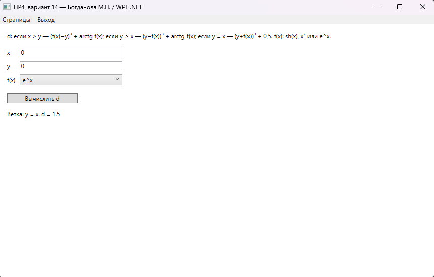

### График y(x)

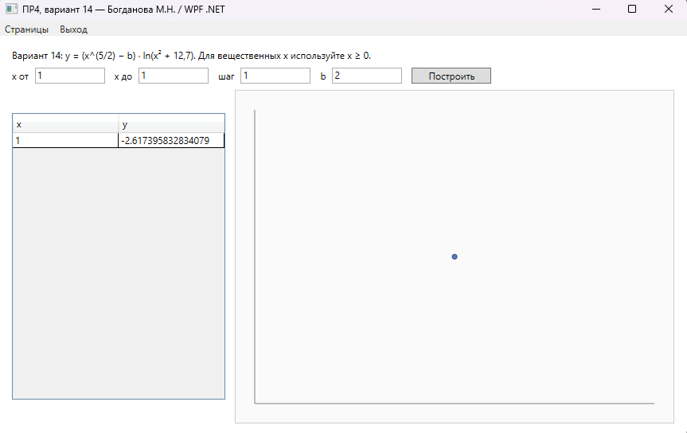
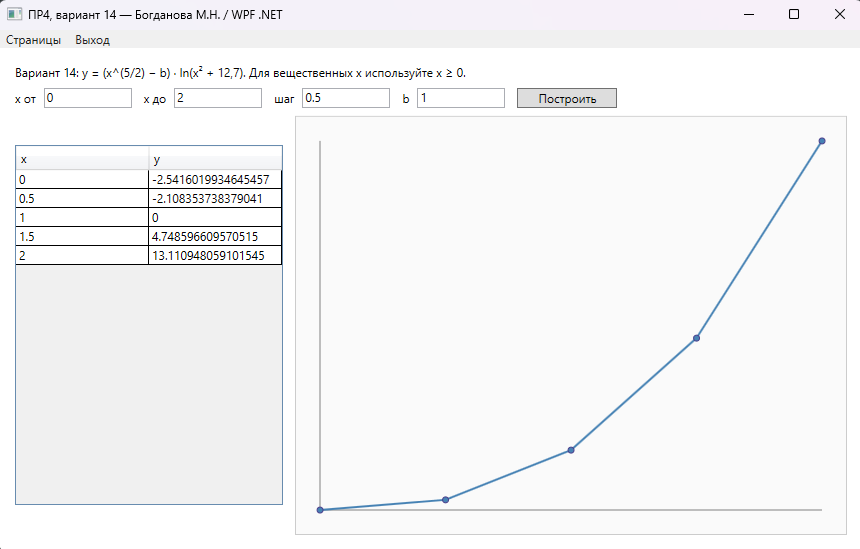
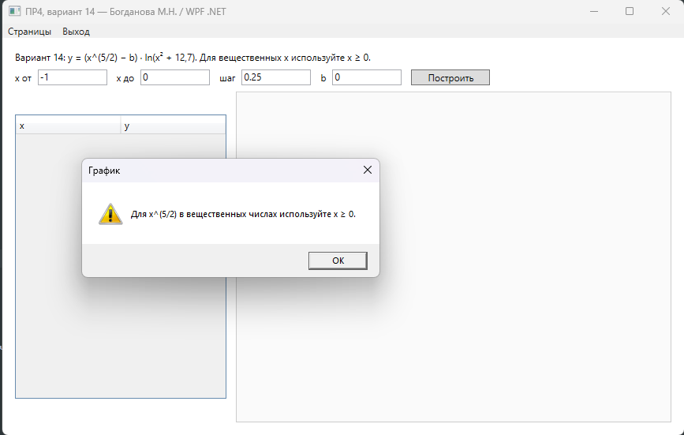
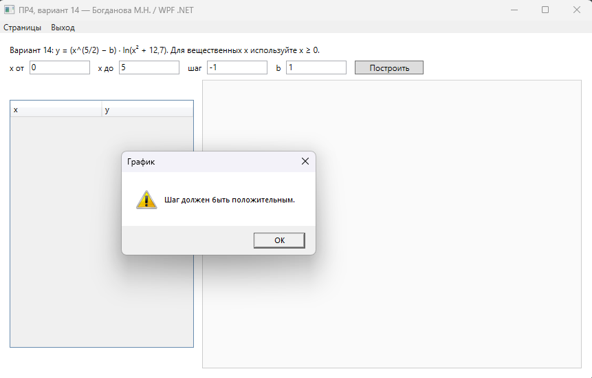

---

## Гайд: что вводить в поля (тесты и скрины)

Угол **z** — в **радианах**. Числа можно вводить **точкой** (`1.5`) или **запятой** (`1,5`).

### Страница «Функция g(x, y, z)»

| № | Зачем | x | y | z | Ожидаемо |
|---|--------|---|---|---|----------|
| 1 | расчёт | `0` | `1` | `1` | g ≈ **1,25** |
| 2 | расчёт | `1` | `3` | `0.523599` (π/6) | g = **9,078125** |
| 3 | ошибка ввода | пусто | `1` | `1` | сообщение о неверном вводе |
| 4 | ОД | `0` | `2` | `1` | **y не может быть 2** |
| 5 | ОД | `1` | `-1` | `1` | **x + y не может быть 0** |
| 6 | ОД | `0` | `1` | `0` | **sin(z) не может быть 0** |

### Страница «Функция d(x, y, f)»

| № | Ветка | f(x) | x | y |
|---|--------|------|---|---|
| 1 | x > y | sh(x) | `2` | `1` |
| 2 | y > x | sh(x) | `0` | `1` |
| 3 | y = x | sh(x) | `0` | `0` |
| 4 | x > y | x² | `3` | `1` |
| 5 | y > x | x² | `1` | `4` |
| 6 | y = x | x² | `2` | `2` |
| 7 | x > y | e^x | `1` | `0` |
| 8 | y > x | e^x | `0` | `2` |
| 9 | y = x | e^x | `0` | `0` |

### Страница «График y(x)»

| № | x от | x до | шаг | b |
|---|------|------|-----|---|
| 1 | `1` | `1` | `1` | `2` |
| 2 | `0` | `2` | `0.5` | `1` |
| 3 | `-1` | `0` | `0.25` | `0` (ожидается отказ: x ≥ 0) |
| 4 | `0` | `5` | `-1` | `1` (ожидается отказ: шаг > 0) |

Для более плавной кривой: **0** … **2**, шаг **0.2**, **b = 1**.
